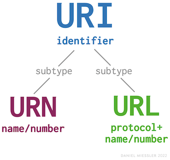
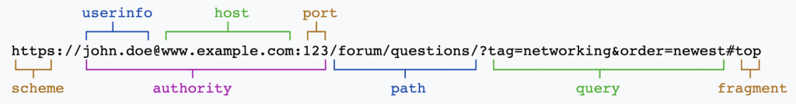
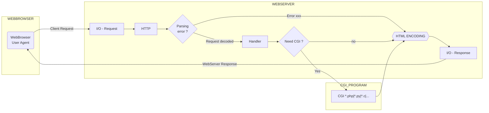
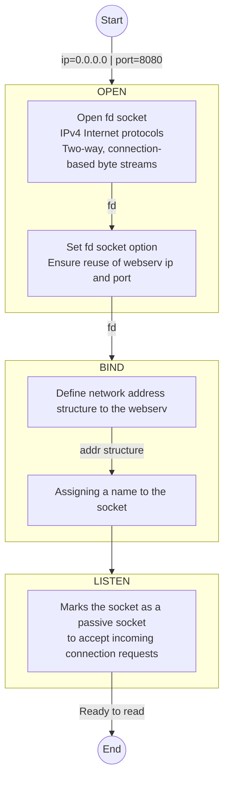

# Webserver


## How to use
- in terminal, just type in 'make'
- then, './webserv' + config file of your choice, you can use 'valid_legit.txt' for testing 

## Content
- [:clock7: Historic](#clock7-historic)
- [:books: Lexic](#books-lexic)
- [:link: Sources](#link-sources)

## :clock7: Historic
[Go to content](#content)

|Date _YYYY-MM-DD_|Description|
|:-|:-|
|2023-02-28|Init|

## Overview
[Go to content](#content)





### Global
**A client** sends a request to the server in the form of a request method, URI, and protocol version, followed by a MIME-like message containing request modifiers, client information, and possible body content over a connection with a server.<br>
**The server** responds with a status line, including the message's protocol version and a success or error code, followed by a MIME-like message containing server information, entity metainformation, and possible entity-body content.<br>


## Socket
[Go to content](#content)



## HTTP
[Go to content](#content)

### Protocol Parameters
```
HTTP-Version   = "HTTP" "/" 1\*DIGIT "." 1\*DIGIT
```
> :warning: Note that the major and minor numbers MUST be treated as separate integers and that each MAY be incremented higher than a single digit. Thus, HTTP/2.4 is a lower version than HTTP/2.13, which in turn is lower than HTTP/12.3. Leading zeros MUST be ignored by recipients and MUST NOT be sent.<br>

```
http_URL = "http:" "//" host [ ":" port ] [ abs_path [ "?" query ]]
```
> :warning: A server SHOULD return 414 (Request-URI Too Long) status if a URI is longer than the server can handle.<br>
> :pushpin: If the port is empty or not given, port 80 is assumed.<br>

## CGI
[Go to content](#content)


## :books: Lexic
[Go to content](#content)

|Name|Description|
|-|-|
|BNF|Backus-Naur Form|
|CGI|Common Gateway Interface|
|URI|Uniform Resource Identifiers (WWW addresses, Universal Document Identifiers, Universal Resource Identifiers)|
|URL|Uniform Resource Locators|
|URN|Uniform Resource Names|

### Lexic - HTTP
|Name|Description|
|-|-|
|client|A program that establishes connections for the purpose of sending requests|
|connection|A transport layer virtual circuit established between two programs for the purpose of communication|
|entity|The information transferred as the payload of a request or response. An entity consists of metainformation in the form of entity-header fields and content in the form of an entity-body|
|gateway|A server which acts as an intermediary for some other server. Unlike a proxy, a gateway receives requests as if it were the origin server for the requested resource; the requesting client may not be aware that it is communicating with a gateway|
|inbound/outbound|Inbound and outbound refer to the request and response paths for messages: "inbound" means "traveling toward the origin server", and "outbound" means "traveling toward the user agent"|
|message|The basic unit of HTTP communication, consisting of a structured sequence of octets matching the syntax and transmitted via the connection|
|origin server|The server on which a given resource resides or is to be created|
|request|An HTTP request message|
|response|An HTTP response message|
|resource|A network data object or service that can be identified by a URI. Resources may be available in multiple representations (e.g. multiple languages, data formats, size, and resolutions) or vary in other ways.|
|tunnel|An intermediary program which is acting as a blind relay between two connections. Once active, a tunnel is not considered a party to the HTTP communication, though the tunnel may have been initiated by an HTTP request. The tunnel ceases to exist when both ends of the relayed connections are closed|
|user agent|The client which initiates a request. These are often browsers, editors, spiders (web-traversing robots), or other end user tools|
|validator|A protocol element (e.g., an entity tag or a Last-Modified time) that is used to find out whether a cache entry is an equivalent copy of an entity|

## Fonctions du sujet

| Nom | Page de man | Resume |
| :-: | :-: | :-: |
| accept         | [accept(2)](https://man7.org/linux/man-pages/man2/accept.2.html) | Accepter une connexion socket |
| bind           | [bind(2)](https://man7.org/linux/man-pages/man2/bind.2.html) | Joindre un socket a une adresse |
| connect        | [connect(2)](https://man7.org/linux/man-pages/man2/connect.2.html) | Initialise une connection sur un socket |
| dup            | [dup(2)](https://man7.org/linux/man-pages/man2/dup.2.html) |  |
| dup2           | [dup2(2)](https://man7.org/linux/man-pages/man2/dup2.2.html) |  |
| epoll_create   | [epoll_create(2)](https://man7.org/linux/man-pages/man2/epoll_create.2.html) |  |
| epoll_ctl      | [epoll_ctl(2)](https://man7.org/linux/man-pages/man2/epoll_ctl.2.html) |  |
| epoll_wait     | [epoll_wait(2)](https://man7.org/linux/man-pages/man2/epoll_wait.2.html) |  |
| errno          | [errno(3)](https://man7.org/linux/man-pages/man3/errno.3.html) |  |
| execve         | [execve(2)](https://man7.org/linux/man-pages/man2/execve.2.html) |  |
| fcntl          | [fcntl(2)](https://man7.org/linux/man-pages/man2/fcntl.2.html) |  |
| fork           | [fork(2)](https://man7.org/linux/man-pages/man2/fork.2.html) |  |
| freeaddrinfo   | [freeaddrinfo(3)](https://man7.org/linux/man-pages/man3/freeaddrinfo.3.html) | Libere la liste chainee retournee par `getaddrinfo` |
| gai_strerror   | [gai_strerror(3)](https://man7.org/linux/man-pages/man3/gai_strerror.3p.html) |  |
| getaddrinfo    | [getaddrinfo(3)](https://man7.org/linux/man-pages/man3/getaddrinfo.3.html) | Une sorte de resolution DNS (?) |
| getprotobyname | [getprotobyname(3)](https://man7.org/linux/man-pages/man3/getprotobyname.3.html) | Permet de recuperer des infos sur un protocole |
| getsockname    | [getsockname(2)](https://man7.org/linux/man-pages/man2/getsockname.2.html) | Recupere un socket a partir d'un nom |
| htonl          | [htonl(3)](https://man7.org/linux/man-pages/man3/htonl.3p.html) | Conversion de boutisme |
| htons          | [htons(3)](https://man7.org/linux/man-pages/man3/htonl.3p.html) | Conversion de boutisme |
| kevent         | N/A |  |
| kqueue         | N/A |  |
| listen         | [listen(2)](https://man7.org/linux/man-pages/man2/listen.2.html) | Attend une connexion a un socket (?) |
| ntohl          | [ntohl(3)](https://man7.org/linux/man-pages/man3/ntohl.3p.html) | Conversion de boutisme |
| ntohs          | [ntohs(3)](https://man7.org/linux/man-pages/man3/ntohl.3p.html) | Conversion de boutisme |
| pipe           | [pipe(2)](https://man7.org/linux/man-pages/man2/pipe.2.html) |  |
| poll           | [poll(2)](https://man7.org/linux/man-pages/man2/poll.2.html) |  |
| recv           | [recv(2)](https://man7.org/linux/man-pages/man2/recv.2.html) | Recevoir un message d'une connexion socket |
| select         | [select(2)](https://man7.org/linux/man-pages/man2/select.2.html) |  |
| send           | [send(2)](https://man7.org/linux/man-pages/man2/send.2.html) | Envoyer un message a une connexion socket |
| setsockopt     | [setsockopt(2)](https://man7.org/linux/man-pages/man2/setsockopt.2.html) | Definir des options sur un socket |
| socket         | [socket(2)](https://man7.org/linux/man-pages/man2/socket.2.html) | Creer un socket |
| strerror       | [strerror(3)](https://man7.org/linux/man-pages/man3/strerror.3.html) |  |

## :link: Sources
[Go to content](#content)

### 42 Subject Tester
- https://projects.intra.42.fr/uploads/document/document/13723/tester
- https://projects.intra.42.fr/uploads/document/document/13724/ubuntu_cgi_tester
- https://projects.intra.42.fr/uploads/document/document/13725/cgi_tester
- https://projects.intra.42.fr/uploads/document/document/13726/ubuntu_tester

### HTTP
- https://developer.mozilla.org/en-US/docs/Web/HTTP/Status

### CGI
- https://www.ionos.fr/digitalguide/sites-internet/developpement-web/quest-ce-que-la-cgi/

### MISC
- https://danielmiessler.com/study/difference-between-uri-url/

#### RFC
|                   RFC                  |                                Titre                               |
|:--------------------------------------:|--------------------------------------------------------------------|
| [RFC 2145](https://www.rfc-editor.org/rfc/rfc2145) | Use and Interpretation of HTTP Version Numbers                     |
| [RFC 2616](https://www.rfc-editor.org/rfc/rfc2616) | Hypertext Transfer Protocol -- HTTP/1.1                            |
| [RFC 7230](https://www.rfc-editor.org/rfc/rfc7230) | Hypertext Transfer Protocol (HTTP/1.1): Message Syntax and Routing |
| [RFC 9112](https://www.rfc-editor.org/rfc/rfc9112) | HTTP/1.1                                                           |
| [RFC 3875](https://www.rfc-editor.org/rfc/rfc3875) | The Common Gateway Interface (CGI) Version 1.1                     | 
